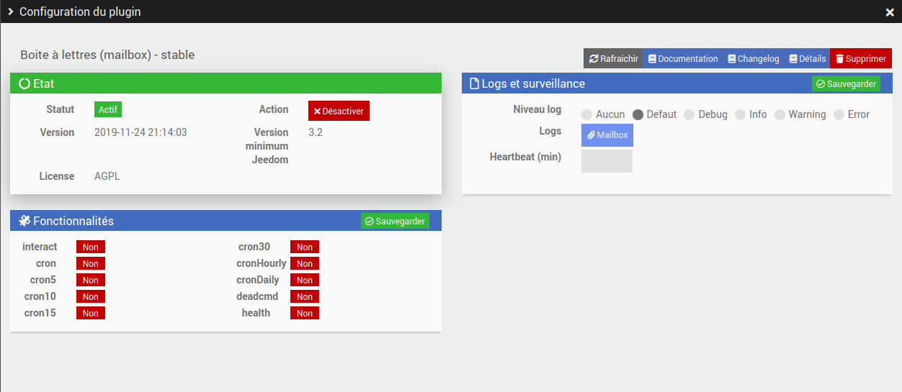
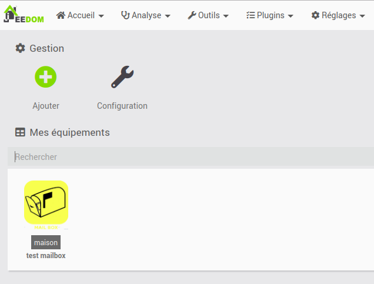
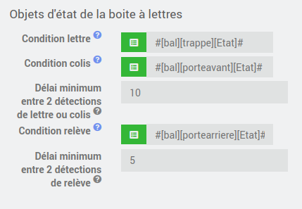
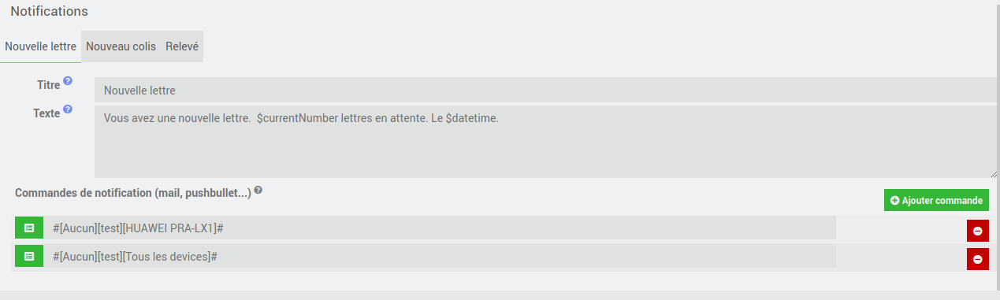
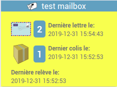

# Présentation

The Mailbox (mailbox) plugin allows the creation of Mailbox devices
and their properties.

We will name a device created by this plugin: mailbox device.

A mailbox device can be created for the following needs:

-   consolidate information from a mailbox's sensors into a single device;

-  display the number of letters and parcels received on a widget;

-   send one or more notifications on receipt of a new letter;

-   send one or more notifications on receipt of a new parcel ;

-   send one or more notifications when collecting mail ;

# Configuration

The plugin does not require any configuration, you just have to activate it :

# Equipment configuration

The configuration of the mailbox equipment is accessible from the
plugin menu:

This is what the mailbox plugin page looks like (here with already one
equipment) :

# Configuration of equipment

## General configuration
The configuration page of a Mailbox equipment first proposes the general parameters:

On this page you can first of all enter the classic Jeedom parameters:
-   **Name of equipment Mailbox** : name of your equipment Mailbox

-   **Parent object** : indicates the parent object to which belongs
    equipment,

-   **Category** : equipment categories (it can belong to
    several categories),

-   **Activate** : makes your equipment active

-   **Visible** : makes it visible on the dashboard

At the top right you have access to 4 buttons :

-   **Advanced (notched wheels)** : displays options
    equipment advances (common to all Jeedom plugins).
    
-   **Duplicate** : duplicates current equipment

-   **Save** : saves current equipment

-   **Remove** : delete current equipment

## Configuration you widget

In the section **Widget** from the equipment page you can configure the parameters of the mailbox widget:

- **Display name** allows to define if the name of the equipment should be displayed or not on the widget
- **Title and counters color** allows to define the color of the title text and the counters displayed on the widget
- **Title and counters background color** allows to define the background color of the title and the counters displayed on the widget
- **Main background color** allows to define the main background color of the widget
- **Text color** allows to define the color of the text displayed on the widget

> **Note**
> The default colors of the widget are as follows:
> - **Title and counters color** #ffffff (white)
> - **Title and counters background color** #60a3bc (blue)
> - **Text color** #737373 (dark gray)
> - **Main background color** #fff176 (yellow)
>
> **Note 2**
> To be sure that the parameters are taken into account on the dashboard, you must make the widget invisible, save and then make it visible again and save again.

## Configuring mailbox status objects

In the section **Mailbox status objects** from the equipment page you can configure the status objects of the mailbox (sensors to detect letters or parcels):

- **Letter condition** is the info command to detect a new letter (for example the state of a letterbox flap opening sensor)
- **Parcel condition** is the info command to detect a new parcel (for example the state of an opening sensor of the front door of the mailbox)
- **Collect Condition** is the info command to detect that the mail has been picked up (for example the condition of a letterbox rear door opening sensor)
- **Minimum time between 2 detections of letter or parcel** is the waiting time between two letter or parcel events in seconds. For example if the front door has been opened twice in less than 5 seconds, only one event will be taken into account

## Configuring notifications

In the section **Notifications** from the page of an equipment you can configure the notifications according to the type of event of the mailbox (notifications requires a notification plugin like email or pushbullet):

- **title** is the title of the notification that will be sent
- **Text** is the text of the notification that will be sent
- **Notification commands** is the list of commands that will be executed to send notifications

> **Tip**
>
>You can use the following variables in the title or text:
> - **$datetime** which is the date of the event in format "m/d/y à H:i:s"
> - **$date** which is the date of the event in format "m/d/y"
> - **$time** which is the time of the event in format "H:i:s"
> - **$time** which is the time of the event in format "H:i:s"
> - **$currentNumber** which is the current number of letters or packages depending on the type of event

Here you find all the configuration of your equipment :

-   **Equipment name Letter box** : name of your virtual equipment,

-   **Parent object** : indicates the parent object to which belongs
    equipment,

-   **Category** : equipment categories (it can belong to
    several categories),

-   **Activate** : makes your equipment active,

-   **Visible** : makes it visible on the dashboard,

-   **Comment** : allows you to comment on
    equipment.

## Configuration of controls

In the tab **Commands** you will find the list of commands :

-   the name displayed on the dashboard,

-   type and subtype,

-   historize: allows to historize the data,

-   display: displays the data on the dashboard,

-   "Test" : allows to test the command,

-   remove (sign -) : allows to delete the command.

### Default commands

When creating a Mailbox device, 4 commands are created by default:
- **Latest statement** (lastStatement) which is the date of the last statement
- **Number Letters** (nbLetters) which is the number of letters pending since the last statement
- **Parcel number** (nbParcels) which is the number of packages since the last reading
- **Collect** (reset) which is the command to do a manual mail recovery

# Dashboard widget

On the dashboard, the Mailbox equipment widget is displayed as follows:

