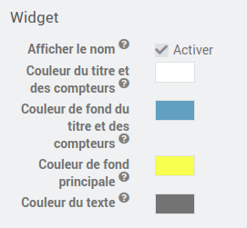

# Présentation

Le plugin Boite à lettres (mailbox) permet la création de périphériques Boite à lettres
et de leurs propriétés.

Nous nommerons un périphérique créé par ce plugin : périphérique boite à lettres.

Un périphérique boite à lettres peut être créé pour les besoins suivants :

-   consolider dans un seul périphérique des informations des capteurs d'une boite à lettres ;

-   afficher sur un widget le nombre de lettres et de colis reçus ;

-   envoyer une ou plusieurs notifications sur réception d'une nouvelle lettre ;

-   envoyer une ou plusieurs notifications sur réception d'un nouveau colis ;

-   envoyer une ou plusieurs notifications lors de la relève du courrier ;

# Configuration

Le plugin ne nécessite aucune configuration, il faut juste l’activer :

# Configuration des équipements

La configuration des équipements boite à lettres est accessible à partir du
menu plugin :

Voilà à quoi ressemble la page du plugin mailbox (ici avec déjà un
équipement) :

# Configuration d'un équipement

## Configuration générale
La page de configuration d’un équipement Boite à lettres propose tout d'abord les paramètres généraux:

Sur cette page vous pouvez tout d'abord renseigner les paramètres classiques Jeedom:
-   **Nom de l'équipement Boite à lettres** : nom de votre équipement Boite à lettres

-   **Objet parent** : indique l’objet parent auquel appartient
    l'équipement,

-   **Catégorie** : les catégories de l'équipement (il peut appartenir à
    plusieurs catégories),

-   **Activer** : permet de rendre votre équipement actif

-   **Visible** : le rend visible sur le dashboard

En haut à droite vous avez accès à 4 boutons :

-   **Avancée (roues crantées)** : permet d’afficher les options
    avancées de l'équipement (commun à tous les plugins Jeedom).
    
-   **Dupliquer** : permet de dupliquer l'équipement courant

-   **Sauvegarder** : permet de sauvegarder l'équipement courant

-   **Supprimer** : permet de supprimer l'équipement courant

## Configuration du widget

Dans la section **Widget** de la page d'un équipement vous pouvez configurer les paramètres du widget de la boite à lettres:

- **Afficher le nom** permet de définir si le nom de l'équipement doit s'afficher ou non sur le widget
- **Couleur du texte** permet de définir la couleur du texte affiché sur le widget

> **Note**
> Pour que les paramètres soient pris en compte sur le dashboard, il faut rendre invisible le widget, sauvegarder puis
le rendre à nouveau visible et resauvegarder.

## Configuration des objets d'état de la boite à lettres

Dans la section **Objets d'état de la boite à lettres** de la page d'un équipement vous pouvez configurer les objets d'état de la boite à lettres (les capteurs permettant de détecter les lettres ou colis):

- **Condition lettre** est la commande d'info permettant de détecter une nouvelle lettre (par exemple l'état d'un capteur d'ouverture de la trappe de la boite à lettres)
- **Condition colis** est la commande d'info permettant de détecter un nouveau colis (par exemple l'état d'un capteur d'ouverture de la porte avant de la boite à lettres)
- **Condition relève** est la commande d'info permettant de détecter que le courrier a été relevé (par exemple l'état d'un capteur d'ouverture de la porte arrière de la boite à lettres)
- **Délai minimum entre 2 détections de lettre ou colis** est le temps d'attente entre deux événements lettres ou colis en secondes. Par exemple si la porte avant a été ouverte deux fois en moins de 5 secondes, un seul événement sera pris en compte

## Configuration des notifications

Dans la section **Notifications** de la page d'un équipement vous pouvez configurer les notifications selon le type d'événment de la boite à lettres (les notifications nécessite un plugin de notification comme le mail ou pushbullet):

- **Titre** est le titre de la notification qui sera envoyée
- **Texte** est le texte de la notification qui sera envoyée
- **Commandes de notification** est la liste des commandes qui seront exécutées pour envoyer les notifications

> **Tip**
>
>Vous pouvez utiliser les variables suivantes dans le titre ou le texte:
> - **$datetime** qui est la date de l'événement au format "d/m/y à H:i:s"
> - **$date** qui est la date de l'événement au format "d/m/y"
> - **$time** qui est l'heure de l'événement au format "H:i:s"
> - **$time** qui est l'heure de l'événement au format "H:i:s"
> - **$currentNumber** qui est le nombre courant de lettres ou de colis selon le type d'événement

Vous retrouvez ici toute la configuration de votre équipement :

-   **Nom de l'équipement Boite à lettres** : nom de votre équipement Boite à lettres,

-   **Objet parent** : indique l’objet parent auquel appartient
    l'équipement,

-   **Catégorie** : les catégories de l'équipement (il peut appartenir à
    plusieurs catégories),

-   **Activer** : permet de rendre votre équipement actif,

-   **Visible** : le rend visible sur le dashboard,

-   **Commentaire** : vous permet de mettre des commentaires sur
    l'équipement.

## Configuration des commandes

Dans l'onglet **Commandes** vous retrouvez la liste des commandes :

-   le nom affiché sur le dashboard,

-   le type et le sous-type,

-   historiser : permet d’historiser la donnée,

-   afficher : permet d’afficher la donnée sur le dashboard,

-   "Tester" : permet de tester la commande,

-   supprimer (signe -) : permet de supprimer la commande.

### Commandes par défault

Lors de la création d'un équipement Boite à lettres, 4 commandes sont créées par défaut:
- **Dernier relevé** (lastStatement) qui est la date du dernier relevé
- **Nombre Lettres** (nbLetters) qui est le nombre de lettres en attente depuis le dernier relevé
- **Nombre Colis** (nbParcels) qui est le nombre de colis depuis le dernier relevé
- **Relever** (reset) qui est la commande pour faire une relève manuelle du courrier

# Widget sur le dashboard

Sur le dashboard, le widget de l'équipement Boite à lettres s'affiche de la manière suivante:

